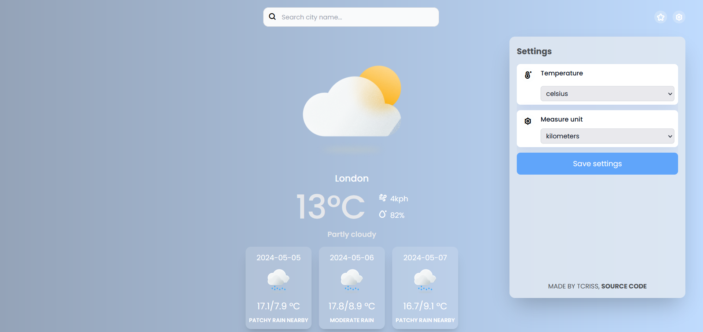
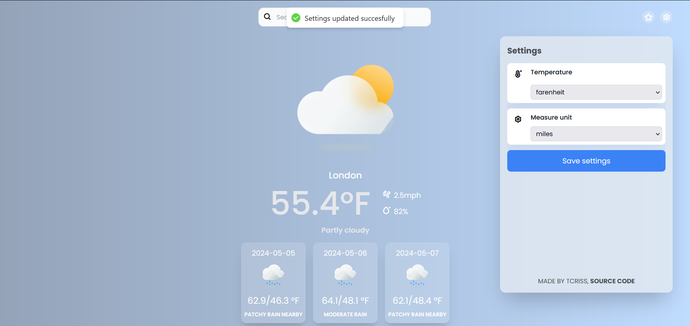

# React Weather App

A simple but elegant weather web api made in react + typescript.

### Screenshots

#### Home

#### Search cities

#### Favorites menu

#### Settings menu

### Stack used
This app uses Vite + SWC. A minimal setup to get React working in Vite with HMR and some ESLint rules.

The weather services are provided by [Free Weather Api](https://www.weatherapi.com/).

### Dependencies

- Axios
- Framer Motion
- Free Weather Api
- TailwindCSS
- Vite
- React Hook Form
- React Hot Toast
- Zustand

### Assets

Icons used in the app: [Weather Icons - Community by Neelesh Chaudhary](https://www.figma.com/community/file/971051749541378755/weather-icons-community?searchSessionId=lvu0htux-009taqkvyu4zn).
