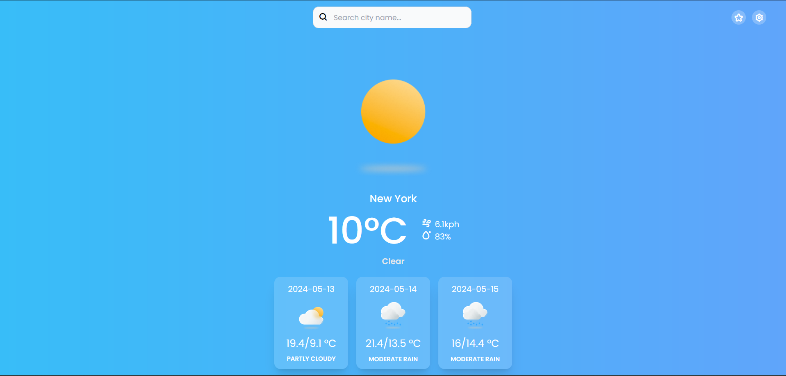

# React Weather App

A simple but elegant weather web api made in react + typescript.

## 🚀 Features

### ⛅ Current weather & forecast
You can select a city in the search reslts or favorites menu to see the current weather status and a 3 days forecast.


### 🔍 Search cities
You can search for other cities and add it as favorite.


### ⭐ Favorites menu
Here are all your favorites cities you marked on search results, to change between them faster.


### ⚙️ Settings menu
Here you can change the configs of the app, now you can only change the temperature units (Celsius/Farenheit) and measure units (Miles/Kilometers).


## Technologies used
This app uses Vite + SWC. A minimal setup to get React working in Vite with HMR and some ESLint rules.

The weather services are provided by [Free Weather Api](https://www.weatherapi.com/).

### 📦 Dependencies

- Axios
- Framer Motion
- Free Weather Api
- TailwindCSS
- Vite
- React Hook Form
- React Hot Toast
- Zustand

##  Setup

### 📃 Requirements

- NodeJS 20.13.1 with pnpm enbled
```bash 
corepack enable pnpm
```
- Vite
```bash
pnpm create vite
```

### ✅ Installation

First execute this command to restore dependencies
```bash
pnpm i
```
Then create your .env file
``` dosini
VITE_KEY = Your api key provided by Free Weather Api team
VITE_URL = https://api.weatherapi.com/v1/ # The Free Weather API epi endpoint to make calls
```

### ▶️ Execution
```bash
pnpm dev
```

## 🧩 Assets

Icons used in the app: [Weather Icons - Community by Neelesh Chaudhary](https://www.figma.com/community/file/971051749541378755/weather-icons-community?searchSessionId=lvu0htux-009taqkvyu4zn).
